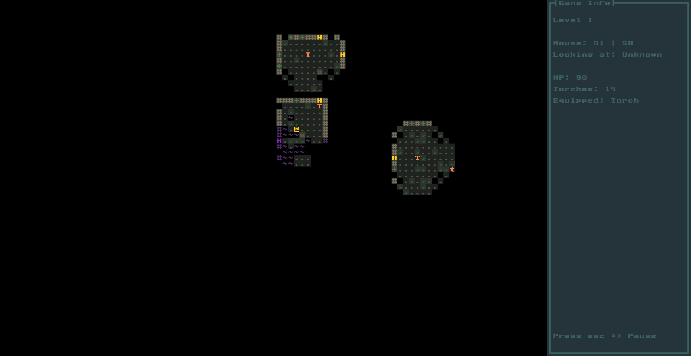

# Darkness Follows - 3m5.GameJam #6

A horror dungeon crawler, built with [Kotlin](https://kotlinlang.org/), [libGDX](https://libgdx.com/) and [Zircon](https://hexworks.org/projects/zircon/).

You finally found the place. You have seen this underground temple many times in your dreams, but now you are finally here. You can hear the madness whispering to you as you walk through the main gate. Let's hope that this was not a huge mistake... 

### Keymap
- **WASD**: Move around your charackter
- **T**: Press repeatedly without moving to place a torch on the ground
- **E**: Press repeatedly while standing on an altar to activate it
- **G**: Grab a torch from the ground (both placed and unlit)
- **1**: Equip torch
- **2**: Equip sword
- **Space**: Wait for one turn
- **Escape**: Pause menu and help

### Gameplay
- Hover over any tile with the mouse to see a description of what it is.
- On each floor is a portal that leads to the next floor.
- Activating all altars activates the portal.
- Activating an altar costs torches, but slightly boosts your health.
- Madness spreads in the dark. Light up areas by placing torches. Torches can be snuffed out by the madness if placed too close.
- Pick up unlit torches so your supply does not run out, or pick up placed torches to relocate them.
- With a torch equipped, you light up the surrounding area and can place torches or activate altars.
- With your sword equipped, you can fight by walking into enemies, but you won't light up your surroundings.
- Travelling through a portal resets your health and torch supply.

### Nice to know
This game was built during the 3m5.GameJam#6 in 2 days. It is a local event aimed at students that want to learn about game development hands on.

The game spawns 2 windows. At the time that we made this game, Zircon did not have full libGDX support (if memory serves correctly) and we did not take the risk to go the experimental route. We instead launch Zircon in a standalone Swing app and provide a line of communication back to libGDX, which handles sounds and music.
